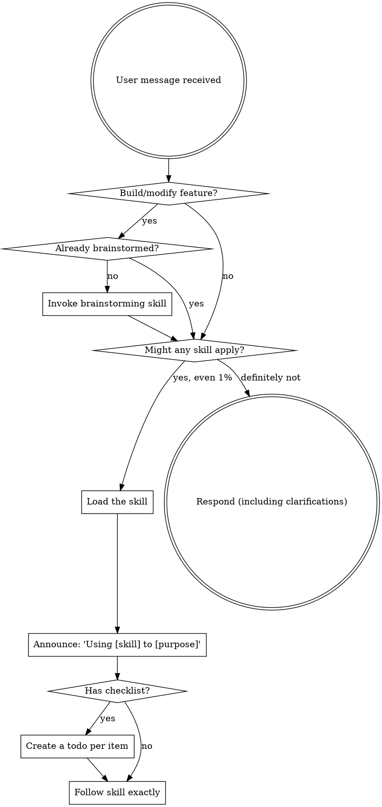

<EXTREMELY-IMPORTANT>
If you think there is even a 1% chance a skill might apply to what you are doing, you ABSOLUTELY MUST invoke the skill.

IF A SKILL APPLIES TO YOUR TASK, YOU DO NOT HAVE A CHOICE. YOU MUST USE IT.

This is not negotiable. This is not optional. You cannot rationalize your way out of this.
</EXTREMELY-IMPORTANT>

## How to Access Skills

Load the skill through your environment's skill-loading mechanism, then follow its content directly.

# Using Skills

## The Rule

**Invoke relevant or requested skills BEFORE any response or action.** Even a 1% chance a skill might apply means that you should invoke the skill to check. If an invoked skill turns out to be wrong for the situation, you don't need to use it.

## Default Workflow Chain

For building or modifying features, the default chain is:
1. **brainstorming** — explore codebase, design, get user approval
2. **writing-plans** — create detailed implementation plan
3. **build-flow** — execute the plan via background workflows
4. **finish-branch** — commit, PR, or keep as-is

Each skill invokes the next. Trigger brainstorming to start; the chain handles the rest.

## Red Flags

These thoughts mean STOP—you're rationalizing:

| Thought | Reality |
|---------|---------|
| "This is just a simple question" | Questions are tasks. Check for skills. |
| "I need more context first" | Skill check comes BEFORE clarifying questions. |
| "Let me explore the codebase first" | Skills tell you HOW to explore. Check first. |
| "I can check git/files quickly" | Files lack conversation context. Check for skills. |
| "Let me gather information first" | Skills tell you HOW to gather information. |
| "This doesn't need a formal skill" | If a skill exists, use it. |
| "I remember this skill" | Skills evolve. Read current version. |
| "This doesn't count as a task" | Action = task. Check for skills. |
| "The skill is overkill" | Simple things become complex. Use it. |
| "I'll just do this one thing first" | Check BEFORE doing anything. |
| "This feels productive" | Undisciplined action wastes time. Skills prevent this. |
| "I know what that means" | Knowing the concept ≠ using the skill. Invoke it. |

## Skill Priority

When multiple skills could apply, use this order:

1. **Process skills first** (brainstorming, debugging) - these determine HOW to approach the task
2. **Implementation skills second** (frontend-design, mcp-builder) - these guide execution

"Let's build X" → brainstorming first, then implementation skills.
"Fix this bug" → debugging first, then domain-specific skills.

## Skill Types

**Rigid** (TDD, debugging): Follow exactly. Don't adapt away discipline.

**Flexible** (patterns): Adapt principles to context.

The skill itself tells you which.

## Fan-out Economics

A subagent fleet's cost is agent count × context size × model rate — dominated by cache traffic, not output. When spawning subagents or authoring ad-hoc workflows, pick the model per stage explicitly. Never let a fleet silently inherit your session's top-tier model:

| Stage | Default |
|---|---|
| Scouts, search, file surveys, mechanical transforms, running tests | fast/cheap tier (e.g. Haiku-class), effort low |
| Implementation, review, fixing | standard tier, effort high |
| Hardest judgment calls (final quality gate, architecture, adversarial verify of critical findings) | strongest tier, effort xhigh |
| frontier tier | only on explicit human request |

Kit's bundled workflows (build-flow, code-review) already pin models per stage. This table governs everything else — one-off Agent calls and workflows you author on the fly. Every agent also keeps its own context lean: scoped test runs with quiet reporters, partial file reads, filtered command output.

## User Instructions

Instructions say WHAT, not HOW. "Add X" or "Fix Y" doesn't mean skip workflows.
