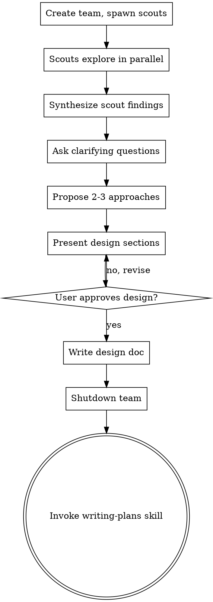

# Brainstorming Ideas Into Designs

## Overview

Help turn ideas into fully formed designs through collaborative dialogue, enhanced by parallel research scouts.

Deploy scouts to explore project context in parallel, synthesize their findings, then ask questions one at a time to refine the idea. Once you understand what you're building, present the design and get user approval.

<HARD-GATE>
Do NOT invoke any implementation skill, write any code, scaffold any project, or take any implementation action until you have presented a design and the user has approved it. This applies to EVERY project regardless of perceived simplicity.
</HARD-GATE>

## Anti-Pattern: "This Is Too Simple To Need A Design"

Every project goes through this process. "Simple" projects are where unexamined assumptions cause the most wasted work. The design can be short, but you MUST present it and get approval.

## Checklist

You MUST create a task for each of these items and complete them in order:

1. **Deploy research scouts** — create team, spawn Explore-type scouts to investigate project context in parallel
2. **Synthesize findings** — collect scout reports, build understanding
3. **Ask clarifying questions** — one at a time, understand purpose/constraints/success criteria
4. **Propose 2-3 approaches** — with trade-offs and your recommendation
5. **Present design** — in sections scaled to their complexity, get user approval after each section
6. **Write design doc** — save to `docs/plans/YYYY-MM-DD-<topic>-design.md`
7. **Shutdown team and transition** — shutdown scouts, invoke writing-plans skill

## Process Flow

**The terminal state is invoking writing-plans.** Do NOT invoke any other implementation skill.

## Research Scout Phase

**REQUIRED:** Use kit:team-orchestration to create the team.

### 1. Create Team

Name: `"brainstorm-<topic>"`

### 2. Spawn Scouts

Spawn 2-3 Explore-type teammates to investigate different aspects in parallel:

- **scout-codebase** (Explore): Explore codebase structure, key patterns, relevant files
- **scout-docs** (Explore): Read docs, README, recent commits related to topic
- **scout-patterns** (Explore): Find similar implementations or patterns in the codebase

Spawn all scouts in a single message for maximum parallelism.

### 3. Synthesize

Collect all scout reports. Build comprehensive understanding before engaging the user.

## The Dialogue

**Understanding the idea:**
- Present synthesized context to the user
- Ask questions one at a time to refine the idea
- Prefer multiple choice questions when possible
- Only one question per message
- Focus on: purpose, constraints, success criteria

**Exploring approaches:**
- Propose 2-3 approaches with trade-offs
- Lead with your recommended option
- Optionally spawn approach-elaboration teammates for parallel deep-dives

**Presenting the design:**
- Scale each section to its complexity
- Ask after each section whether it looks right
- Cover: architecture, components, data flow, error handling, testing

## After the Design

**Documentation:**
- Write validated design to `docs/plans/YYYY-MM-DD-<topic>-design.md`
- Save the design document (user will commit when ready)

**Shutdown:**
- Shutdown all scout teammates (kit:team-orchestration shutdown protocol)

**Implementation:**
- Invoke the writing-plans skill to create implementation plan
- Do NOT invoke any other skill. writing-plans is the next step.

## Key Principles

- **One question at a time** — don't overwhelm
- **Multiple choice preferred** — easier to answer
- **YAGNI ruthlessly** — remove unnecessary features
- **Explore alternatives** — always propose 2-3 approaches
- **Incremental validation** — get approval before moving on
- **Scouts enhance, don't replace dialogue** — human conversation is the core
