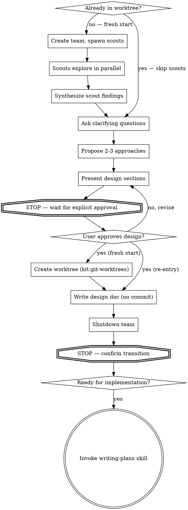

# Brainstorming Ideas Into Designs

## Overview

Help turn ideas into fully formed designs through collaborative dialogue, enhanced by parallel research scouts.

Deploy scouts to explore project context in parallel, synthesize their findings, then ask questions one at a time to refine the idea. Once you understand what you're building, present the design and get user approval.

<HARD-GATE>
Do NOT invoke any implementation skill, write any code, scaffold any project, or take any implementation action until you have presented a design and your human partner has approved it. This applies to EVERY project regardless of perceived simplicity.
</HARD-GATE>

## Anti-Pattern: "This Is Too Simple To Need A Design"

Every project goes through this process. "Simple" projects are where unexamined assumptions cause the most wasted work. The design can be short, but you MUST present it and get approval.

## Checklist

You MUST create a task for each of these items and complete them in order:

1. **Deploy research scouts** — create team, spawn Explore-type scouts to investigate project context in parallel
2. **Synthesize findings** — collect scout reports, build understanding
3. **Ask clarifying questions** — one at a time, understand purpose/constraints/success criteria
4. **Propose 2-3 approaches** — with trade-offs and your recommendation
5. **Present design** — in sections scaled to their complexity, ask after each section whether it looks right so far
6. **Get explicit design approval** — STOP and wait for your human partner to confirm the design. Do NOT proceed until they explicitly approve. If they have concerns, revise and re-present.
7. **Create worktree** — on design approval, invoke kit:git-worktrees to create isolated workspace and cd into it
8. **Write design doc** — save to `docs/plans/YYYY-MM-DD-<topic>-design.md` in the worktree (do NOT commit)
9. **Shutdown team** — shutdown all scout teammates (kit:team-orchestration shutdown protocol)
10. **STOP — confirm transition** — Tell your human partner the design is documented and ask if they're ready to move to implementation planning. Do NOT invoke writing-plans until they confirm.
11. **Invoke writing-plans** — on confirmation, invoke kit:writing-plans to create the implementation plan

## Re-Entry (Same Worktree)

When brainstorming is re-invoked after implementation feedback (already in a worktree):

**Detection:**
```bash
# Check if we're in a worktree (not the main working tree)
git worktree list --porcelain | grep -A2 "$(pwd)"
```

If already in a worktree:
- **Skip** scout phase (codebase context already established)
- **Skip** worktree creation (already in one)
- Go straight to dialogue with the existing design doc as context
- Read existing `docs/plans/*-design.md` to understand prior design decisions
- If multiple design docs exist, read the most recent one (latest date prefix)
- Write updated/new design doc to same `docs/plans/` directory

## Process Flow



**The terminal state is invoking writing-plans.** Do NOT invoke any other implementation skill.

## Research Scout Phase

**REQUIRED (fresh start only):** Use kit:team-orchestration to create the team.

### 1. Create Team

Name: `"brainstorm-<topic>"`

### 2. Spawn Scouts

Spawn 2-3 Explore-type teammates to investigate different aspects in parallel:

- **scout-codebase** (Explore): Explore codebase structure, key patterns, relevant files
- **scout-docs** (Explore): Read docs, README, recent commits related to topic
- **scout-patterns** (Explore): Find similar implementations or patterns in the codebase

Spawn all scouts in a single message for maximum parallelism.

### 3. Synthesize

Collect all scout reports. Build comprehensive understanding before engaging your human partner.

## The Dialogue

**Understanding the idea:**
- Present synthesized context to your human partner (or existing design context on re-entry)
- Ask questions one at a time to refine the idea
- Prefer multiple choice questions when possible
- Only one question per message
- Focus on: purpose, constraints, success criteria

**Exploring approaches:**
- Propose 2-3 approaches with trade-offs
- Lead with your recommended option
- Optionally spawn approach-elaboration teammates for parallel deep-dives

**Presenting the design:**
- Once you believe you understand what you're building, present the design
- Scale each section to its complexity: a few sentences if straightforward, up to 200-300 words if nuanced
- Ask after each section whether it looks right so far
- Cover: architecture, components, data flow, error handling, testing
- Be ready to go back and clarify if something doesn't make sense

<HARD-GATE>
After presenting the design, STOP and wait for your human partner to explicitly approve it. Do NOT write the design doc, create a worktree, or invoke any other skill until they confirm. "Looks good", "approved", "let's go" = proceed. Anything else = revise and re-present.
</HARD-GATE>

## After the Design (only after explicit approval)

**Worktree (fresh start only):**
- Invoke kit:git-worktrees to create worktree and cd into it
- Branch name: Derive from topic using kebab-case with a feature/ prefix (e.g., feature/auth-system)
- This is the moment isolation begins

**Documentation:**
- Write validated design to `docs/plans/YYYY-MM-DD-<topic>-design.md`
- Do NOT commit the design document

**Shutdown:**
- Shutdown all scout teammates (kit:team-orchestration shutdown protocol)

<HARD-GATE>
After writing the design doc and shutting down scouts, STOP and ask your human partner if they are ready to proceed to implementation planning. Do NOT invoke writing-plans until they confirm. They may want to review the design doc, make changes, or take a break before continuing.
</HARD-GATE>

**Implementation (only after human confirms):**
- Invoke the writing-plans skill to create implementation plan
- Do NOT invoke any other skill. writing-plans is the next step.

## Key Principles

- **One question at a time** — don't overwhelm
- **Multiple choice preferred** — easier to answer
- **YAGNI ruthlessly** — remove unnecessary features
- **Explore alternatives** — always propose 2-3 approaches
- **Incremental validation** — get approval before moving on
- **Scouts enhance, don't replace dialogue** — human conversation is the core
- **No commits** — design docs are workspace artifacts, not git artifacts
