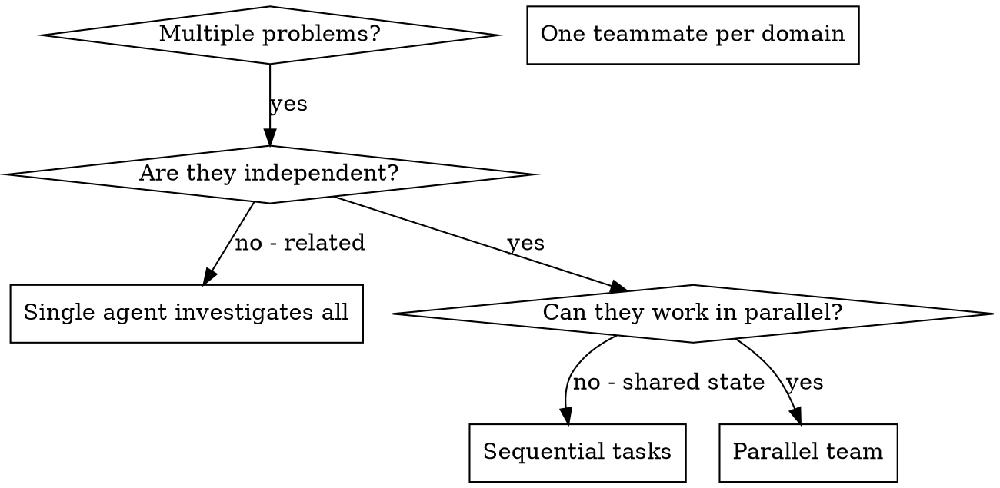

# Dispatching Parallel Agents

## Overview

When you have multiple unrelated problems (different test files, different subsystems, different bugs), investigating them sequentially wastes time. Use a team to coordinate parallel work with shared task lists and mid-task communication.

**Core principle:** One teammate per independent problem domain. Team coordination for progress tracking and communication.

## When to Use

**Use when:**
- 3+ test files failing with different root causes
- Multiple subsystems broken independently
- Each problem understood without context from others
- No shared state between investigations

**Don't use when:**
- Failures are related (fix one might fix others)
- Need to understand full system state
- Teammates would interfere (editing same files)

## The Pattern

### 1. Identify Independent Domains

Group failures by what's broken. Each domain is independent — fixing one doesn't affect others.

### 2. Create Team

**REQUIRED:** Use kit:team-orchestration to set up the team.

### 3. Spawn Teammates and Assign Work

One teammate per domain. Include the task in the spawn prompt so they start immediately. Spawn all teammates in a single message for maximum parallelism.

Each teammate gets:
- **Specific scope:** One problem domain
- **Clear goal:** What to fix/investigate
- **Constraints:** Don't change unrelated code
- **Communication:** Ask questions via SendMessage if blocked
- **Output:** Report summary of root cause and changes

### 4. Monitor and Coordinate

- Use `TaskList` to track progress
- Answer teammate questions via SendMessage as they arise
- If a teammate finishes early, assign additional work via SendMessage
- If two teammates discover overlap, they coordinate via DM

### 5. Review and Integrate

When all teammates report:
- Read each summary
- Verify fixes don't conflict
- Run full test suite
- Integrate all changes
- Shutdown team (kit:team-orchestration shutdown protocol)

## Dynamic Rebalancing

If one teammate finishes before others, send additional work via SendMessage.

## Teammate Prompt Structure

Good teammate prompts are:
1. **Focused** — one clear problem domain
2. **Self-contained** — all context needed
3. **Specific about output** — what to report
4. **Communication-aware** — ask questions via SendMessage if blocked

## Common Mistakes

**Too broad:** "Fix all the tests" — teammate gets lost.
**No context:** "Fix the race condition" — teammate doesn't know where.
**No constraints:** Teammate might refactor everything.
**Vague output:** "Fix it" — you don't know what changed.

## Advantages Over Raw Task Dispatch

| Feature | Raw Task | Team |
|---------|----------|------|
| Mid-task communication | None — wait for return | SendMessage anytime |
| Progress tracking | Wait for return | TaskList |
| Dynamic rebalancing | Not possible | Assign via message |
| Overlap detection | After the fact | Real-time DM |

## Verification

After all teammates report:
1. **Review each summary** — understand what changed
2. **Check for conflicts** — did teammates edit same code?
3. **Run full suite** — verify all fixes work together
4. **Spot check** — teammates can make systematic errors

## Integration

**Required:** kit:team-orchestration — set up team before starting
