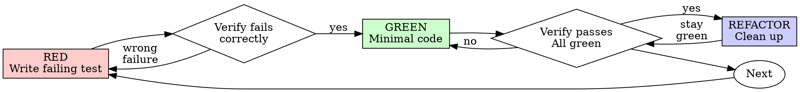

# Test-Driven Development (TDD)

## Overview

Write the test first. Watch it fail. Write minimal code to pass.

**Core principle:** If you didn't watch the test fail, you don't know if it tests the right thing.

## When to Use

**Always:**
- New features
- Bug fixes
- Refactoring
- Behavior changes

**Exceptions (ask your human partner):**
- Throwaway prototypes
- Generated code
- Configuration files

## Hard Gate: No Production Code Without a Failing Test First

Write code before the test? Delete it and start over.

This is the one rule that cannot bend. Code written before a test is untestable by definition — you've already been influenced by the implementation. Keeping it "as reference" or "adapting" it while writing tests means the tests describe what you built, not what you need. The test can't catch bugs in logic you've already committed to.

Delete means delete. Implement fresh from tests.

## Red-Green-Refactor



### RED - Write Failing Test

Write one minimal test showing what should happen.

<Good>
```typescript
test('retries failed operations 3 times', async () => {
  let attempts = 0;
  const operation = () => {
    attempts++;
    if (attempts < 3) throw new Error('fail');
    return 'success';
  };

  const result = await retryOperation(operation);

  expect(result).toBe('success');
  expect(attempts).toBe(3);
});
```
Clear name, tests real behavior, one thing
</Good>

<Bad>
```typescript
test('retry works', async () => {
  const mock = jest.fn()
    .mockRejectedValueOnce(new Error())
    .mockRejectedValueOnce(new Error())
    .mockResolvedValueOnce('success');
  await retryOperation(mock);
  expect(mock).toHaveBeenCalledTimes(3);
});
```
Vague name, tests mock not code
</Bad>

**Requirements:**
- One behavior
- Clear name
- Real code (no mocks unless unavoidable)

### Verify RED - Watch It Fail

Run the test before writing any implementation. A test you haven't watched fail could be testing the wrong thing, passing for the wrong reason, or not exercising the code path you think it does.

```bash
npm test path/to/test.test.ts
```

Confirm:
- Test fails (not errors)
- Failure message is expected
- Fails because feature missing (not typos)

**Test passes?** You're testing existing behavior. Fix test.

**Test errors?** Fix error, re-run until it fails correctly.

### GREEN - Minimal Code

Write simplest code to pass the test.

<Good>
```typescript
async function retryOperation<T>(fn: () => Promise<T>): Promise<T> {
  for (let i = 0; i < 3; i++) {
    try {
      return await fn();
    } catch (e) {
      if (i === 2) throw e;
    }
  }
  throw new Error('unreachable');
}
```
Just enough to pass
</Good>

<Bad>
```typescript
async function retryOperation<T>(
  fn: () => Promise<T>,
  options?: {
    maxRetries?: number;
    backoff?: 'linear' | 'exponential';
    onRetry?: (attempt: number) => void;
  }
): Promise<T> {
  // YAGNI
}
```
Over-engineered
</Bad>

Don't add features, refactor other code, or "improve" beyond the test.

### Verify GREEN - Watch It Pass

Run the test again after implementation. This confirms the code actually satisfies the test, not just that it compiles. It also catches regressions in other tests.

```bash
npm test path/to/test.test.ts
```

Confirm:
- Test passes
- Other tests still pass
- Output pristine (no errors, warnings)

**Test fails?** Fix code, not test.

**Other tests fail?** Fix now.

### REFACTOR - Clean Up

After green only:
- Remove duplication
- Improve names
- Extract helpers

Keep tests green. Don't add behavior.

### Repeat

Next failing test for next feature.

## Good Tests

| Quality | Good | Bad |
|---------|------|-----|
| **Minimal** | One thing. "and" in name? Split it. | `test('validates email and domain and whitespace')` |
| **Clear** | Name describes behavior | `test('test1')` |
| **Shows intent** | Demonstrates desired API | Obscures what code should do |

## Why Order Matters

The distinction between test-first and test-after isn't ritual — it changes what the tests prove.

**Tests written after code pass immediately.** A test that has never failed proves nothing: it might test the wrong thing, test implementation details instead of behavior, or miss edge cases you forgot. Watching a test fail first proves it actually detects the absence of the feature.

**"I already manually tested all the edge cases"** — Manual testing is ad-hoc. There's no record of what you tested, it can't be re-run when code changes, and it's easy to forget cases under pressure. Automated tests are systematic and repeatable.

**"Deleting X hours of work is wasteful"** — The time is already gone (sunk cost). The real waste is keeping code you can't trust. Rewriting with TDD takes comparable time but produces code backed by tests that have proven they catch failures.

**"TDD is dogmatic, being pragmatic means adapting"** — TDD is the pragmatic choice. It finds bugs before commit, prevents regressions, documents behavior, and enables safe refactoring. Skipping it means debugging in production, which is slower.

**"Tests after achieve the same goals"** — Tests-after answer "what does this code do?" Tests-first answer "what should this code do?" Tests-after are biased by your implementation — you test what you built, not what's required. Tests-first force edge case discovery before implementing.

## Recognizing When You've Left TDD

These patterns indicate the test-first cycle has been broken. When you notice one, return to the hard gate: delete implementation code and start from a failing test.

- Code written before test
- Test written after implementation
- Test passes immediately (never failed)
- Can't explain why test failed
- Tests deferred to "later"
- Rationalizing "just this once"
- Keeping implementation code "as reference"

| Common excuse | Why it doesn't hold |
|---------------|---------------------|
| "Too simple to test" | Simple code breaks too, and the test takes 30 seconds. |
| "Need to explore first" | Exploration is fine — throw it away and start with TDD. |
| "Test is hard to write" | Hard to test usually means hard to use. Listen to the test and simplify the design. |
| "Existing code has no tests" | You're improving it now. Add tests for the code you're changing. |

## Example: Bug Fix

**Bug:** Empty email accepted

**RED**
```typescript
test('rejects empty email', async () => {
  const result = await submitForm({ email: '' });
  expect(result.error).toBe('Email required');
});
```

**Verify RED**
```bash
$ npm test
FAIL: expected 'Email required', got undefined
```

**GREEN**
```typescript
function submitForm(data: FormData) {
  if (!data.email?.trim()) {
    return { error: 'Email required' };
  }
  // ...
}
```

**Verify GREEN**
```bash
$ npm test
PASS
```

**REFACTOR**
Extract validation for multiple fields if needed.

## Verification Checklist

Before marking work complete:

- [ ] Every new function/method has a test
- [ ] Watched each test fail before implementing
- [ ] Each test failed for expected reason (feature missing, not typo)
- [ ] Wrote minimal code to pass each test
- [ ] All tests pass
- [ ] Output pristine (no errors, warnings)
- [ ] Tests use real code (mocks only if unavoidable)
- [ ] Edge cases and errors covered

Can't check all boxes? Go back and fill the gaps before continuing.

## When Stuck

| Problem | Solution |
|---------|----------|
| Don't know how to test | Write wished-for API. Write assertion first. Ask your human partner. |
| Test too complicated | Design too complicated. Simplify interface. |
| Must mock everything | Code too coupled. Use dependency injection. |
| Test setup huge | Extract helpers. Still complex? Simplify design. |

## Debugging Integration

Bug found? Write failing test reproducing it. Follow TDD cycle. Test proves fix and prevents regression.

Fixing bugs without a test means you can't prove the fix works or detect if the bug returns.

## Testing Anti-Patterns

When adding mocks or test utilities, read `testing-anti-patterns.md` in this directory to avoid common pitfalls:
- Testing mock behavior instead of real behavior
- Adding test-only methods to production classes
- Mocking without understanding dependencies
