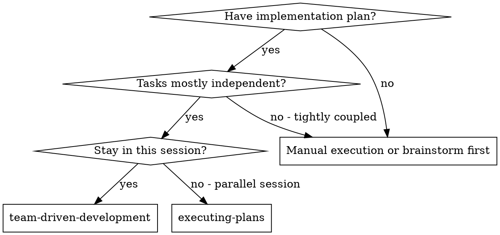
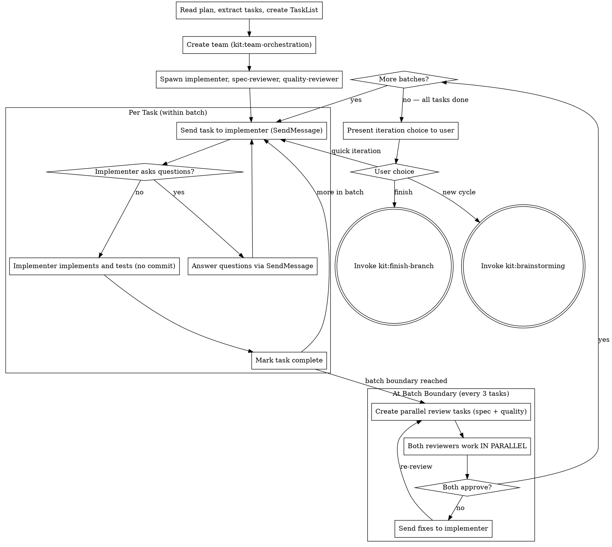

# Team-Driven Development

Execute plan by creating a team with persistent teammates: an implementer and two reviewers (spec compliance + code quality). Reviews run at batch boundaries.

**Core principle:** Persistent team + batch-boundary reviews = high quality, fast iteration, no premature commits.

## When to Use



**vs. Executing Plans (parallel session):**
- Same session (no context switch)
- Persistent teammates (accumulated context across tasks)
- Parallel reviews at batch boundaries (spec + quality simultaneously)
- Faster iteration (no human-in-loop between tasks)

## The Process



## Team Setup

**REQUIRED:** Use kit:team-orchestration to create the team.

1. **Create team:** `TeamCreate` with plan-derived name
2. **Spawn 3 persistent teammates:**
   - `implementer` (general-purpose) — uses `./implementer-prompt.md`
   - `spec-reviewer` (general-purpose) — uses `./spec-reviewer-prompt.md`
   - `quality-reviewer` (general-purpose) — uses `./quality-reviewer-prompt.md`
3. **Verify team:** Read config, confirm all 3 registered

## Task Assignment Pattern

### First Task

Include in the implementer's spawn prompt so they start working immediately.

### Subsequent Tasks

Send via SendMessage to the implementer:

```
## Task N: [name]

[Full task text from plan]

## Context

[Where this fits, what changed in previous tasks]
```

Provide full text — don't make the implementer read the plan file.

### Batch-Boundary Reviews

**Default batch size: 3 tasks.**

Adjust if needed:
- If the plan has fewer tasks than the batch size, review after all tasks complete
- If tasks are large or complex, reduce batch size to 1-2
- If your human partner requests a different batch size, honor it

After a batch of tasks completes, create two review tasks simultaneously:

- Spec review task -> owner: spec-reviewer, blockedBy: last implementation task in batch
- Quality review task -> owner: quality-reviewer, blockedBy: last implementation task in batch

Both reviewers check all changes from the batch. Both work at the same time. Wait for both to report.

### Review Results

- **Both approve:** Proceed to next batch
- **Either finds issues:** Forward findings to implementer, implementer fixes, re-run reviews
- **Reviewers disagree:** Team lead adjudicates

## After All Tasks Complete

### Shutdown Team

Shutdown all teammates (kit:team-orchestration shutdown protocol).

### Present Iteration Choice

Ask your human partner explicitly:

```
Implementation complete. What would you like to do?

1. Finish the branch — finalize this work (kit:finish-branch presents options)
2. Quick iteration — describe what needs changing, I'll continue
3. New brainstorming cycle — restart design process on this worktree (kit:brainstorming)
```

**Always ask. Never decide automatically.**

- **Option 1:** Invoke kit:finish-branch
- **Option 2:** Your human partner describes changes, re-enter team-dev task loop on same worktree
- **Option 3:** Re-invoke kit:brainstorming (will detect existing worktree, skip scouts and worktree creation)

## Prompt Templates

- `./implementer-prompt.md` — Spawn prompt for implementer teammate
  - REQUIRED: Follow TDD — write the failing test FIRST, verify it fails, then implement minimally.
- `./spec-reviewer-prompt.md` — Spawn prompt for spec compliance reviewer
- `./quality-reviewer-prompt.md` — Spawn prompt for quality reviewer

## Red Flags

**Never:**
- Commit during implementation (commits are your human partner's decision)
- Start implementation on main/master branch without explicit user consent
- Skip reviews at batch boundaries (spec compliance OR code quality)
- Proceed with unfixed issues
- Re-spawn teammates for each task (they're persistent — message them)
- Make teammates read plan file (provide full text instead)
- Skip scene-setting context (teammate needs to understand where task fits)
- Ignore teammate questions (answer before letting them proceed)
- Accept "close enough" on spec compliance (spec reviewer found issues = not done)
- Skip review loops (reviewer found issues = implementer fixes = review again)
- Let implementer self-review replace actual review (both are needed)
- **Start quality review before spec compliance passes** — reviews run in parallel, but if spec review finds missing requirements, quality review of wrong code is wasted
- Move to next task while either review has open issues
- Decide iteration path without asking your human partner

**If implementer asks questions:**
- Answer via SendMessage, clearly and completely

**If reviewer finds issues:**
- Forward findings to implementer via SendMessage
- Implementer fixes
- Both reviewers re-review
- Repeat until both approve

## Integration

**Required workflow skills:**
- **kit:team-orchestration** — REQUIRED: Set up team before starting
- **kit:git-worktrees** — REQUIRED: Set up isolated workspace before starting
- **kit:writing-plans** — Creates the plan this skill executes
- **kit:code-review** — Review patterns (team-dev uses batch-boundary reviews, not per-task)
- **kit:finish-branch** — Complete development after your human partner approves
- **kit:brainstorming** — Re-entry for design changes

**Teammates should use:**
- **kit:tdd** — Implementer follows TDD for each task

**Alternative workflow:**
- **kit:executing-plans** — Use for parallel session instead of same-session
