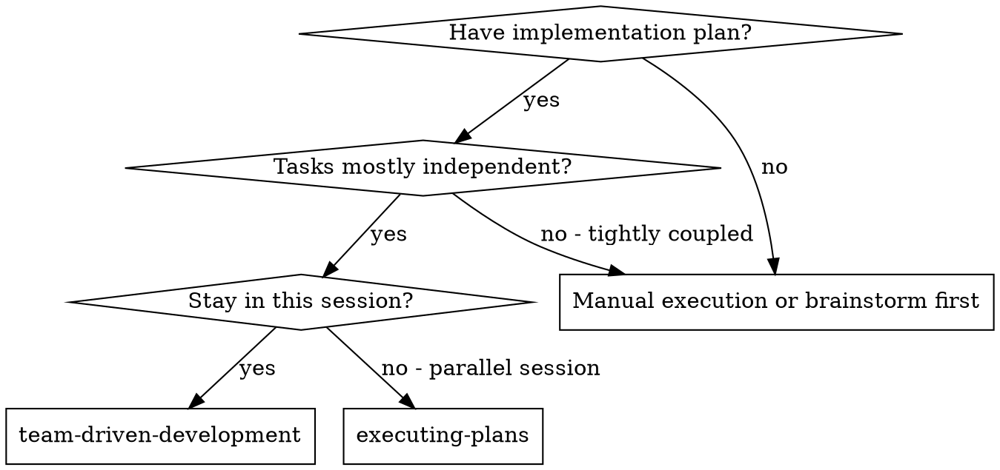
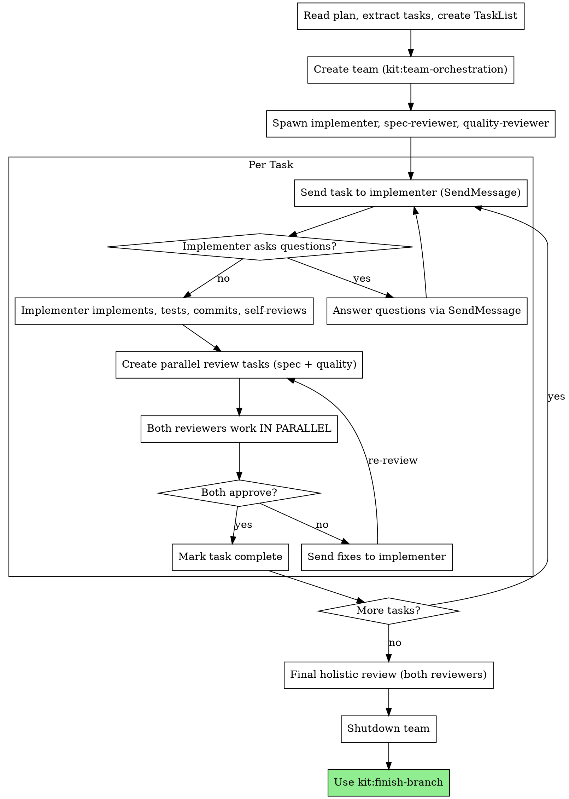

# Team-Driven Development

Execute plan by creating a team with persistent teammates: an implementer and two reviewers (spec compliance + code quality). Reviews run in parallel after each task.

**Core principle:** Persistent team + parallel reviews = high quality, fast iteration.

## When to Use



**vs. Executing Plans (parallel session):**
- Same session (no context switch)
- Persistent teammates (accumulated context across tasks)
- Parallel reviews after each task (spec + quality simultaneously)
- Faster iteration (no human-in-loop between tasks)

## The Process



## Team Setup

**REQUIRED:** Use kit:team-orchestration to create the team.

1. **Create team:** `TeamCreate` with plan-derived name
2. **Spawn 3 persistent teammates:**
   - `implementer` (general-purpose) — uses `./implementer-prompt.md`
   - `spec-reviewer` (general-purpose) — uses `./spec-reviewer-prompt.md`
   - `quality-reviewer` (general-purpose) — uses `./quality-reviewer-prompt.md`
3. **Verify team:** Read config, confirm all 3 registered

## Task Assignment Pattern

### First Task

Include in the implementer's spawn prompt so they start working immediately.

### Subsequent Tasks

Send via SendMessage to the implementer:

```
## Task N: [name]

[Full task text from plan]

## Context

[Where this fits, what changed in previous tasks]
```

Provide full text — don't make the implementer read the plan file.

### Parallel Reviews

After implementer completes a task, create two review tasks simultaneously:

- Spec review task → owner: spec-reviewer, blockedBy: implementation task
- Quality review task → owner: quality-reviewer, blockedBy: implementation task

Both reviewers work at the same time. Wait for both to report.

### Review Results

- **Both approve:** Mark task complete, assign next task
- **Either finds issues:** Forward findings to implementer, implementer fixes, re-run reviews
- **Reviewers disagree:** Team lead adjudicates

## Pipeline Overlap (Cautious)

When consecutive tasks are **clearly non-overlapping** (different files/modules):

1. While task N is in review, assign task N+1 to implementer
2. If N's review finds issues, implementer pauses N+1 to fix N first

**Default:** Sequential. Only overlap when non-overlap is obvious.

## Prompt Templates

- `./implementer-prompt.md` — Spawn prompt for implementer teammate
- `./spec-reviewer-prompt.md` — Spawn prompt for spec compliance reviewer
- `./quality-reviewer-prompt.md` — Spawn prompt for quality reviewer

## Example Workflow

```
You: I'm using Team-Driven Development to execute this plan.

[Read plan file once, extract all 5 tasks with full text]
[Create team: "implement-feature-x"]
[Spawn implementer with Task 1 in spawn prompt]
[Spawn spec-reviewer with role prompt]
[Spawn quality-reviewer with role prompt]

Task 1: Hook installation script

Implementer: "Before I begin — should the hook be user or system level?"

You: [SendMessage to implementer] "User level (~/.config/kit/hooks/)"

Implementer: [works, commits, reports completion]

[Create spec review task + quality review task — both start simultaneously]

Spec reviewer: ✅ Spec compliant
Quality reviewer: Strengths: Good. Issues: None. Approved.

[Mark Task 1 complete]

Task 2: Recovery modes

[SendMessage to implementer with Task 2 context]

Implementer: [works, commits, reports]

[Parallel reviews]
Spec reviewer: ❌ Missing progress reporting
Quality reviewer: Issues (Important): Magic number

[Forward both sets of findings to implementer]
Implementer: [fixes both, commits]

[Re-run parallel reviews]
Spec reviewer: ✅ Spec compliant now
Quality reviewer: ✅ Approved

[Mark Task 2 complete]
...

[After all tasks: final holistic review by both reviewers]
[Shutdown team → finish-branch]
```

## Advantages

**vs. Raw Task dispatch:**
- Parallel reviews (halves review wall-clock time)
- Persistent teammates (accumulated context across tasks)
- Direct teammate communication (reviewer DMs implementer)
- Shared task list (visible progress, dependencies)
- Pipeline overlap potential

**Quality gates:**
- Self-review catches issues before handoff
- Parallel spec + quality review
- Review loops ensure fixes work
- Persistent reviewers catch cross-task consistency issues

## Red Flags

**Never:**
- Start implementation on main/master branch without explicit user consent
- Skip reviews (spec compliance OR code quality)
- Proceed with unfixed issues
- Re-spawn teammates for each task (they're persistent — message them)
- Make teammates read plan file (provide full text instead)
- Skip scene-setting context
- Ignore teammate questions
- Accept "close enough" on spec compliance
- Skip review loops
- Let implementer self-review replace actual review
- Move to next task while either review has open issues
- Start quality review before confirming spec compliance — reviews run in parallel, but if spec review finds missing requirements, quality review effort may be wasted. Team lead should be prepared to discard quality findings and re-request after implementer fixes spec issues.

**If implementer asks questions:**
- Answer via SendMessage, clearly and completely

**If reviewer finds issues:**
- Forward findings to implementer via SendMessage
- Implementer fixes, commits
- Both reviewers re-review
- Repeat until both approve

## Integration

**Required workflow skills:**
- **kit:team-orchestration** — REQUIRED: Set up team before starting
- **kit:git-worktrees** — REQUIRED: Set up isolated workspace before starting
- **kit:writing-plans** — Creates the plan this skill executes
- **kit:code-review** — Review patterns for reviewer teammates
- **kit:finish-branch** — Complete development after all tasks

**Teammates should use:**
- **kit:tdd** — Implementer follows TDD for each task

**Alternative workflow:**
- **kit:executing-plans** — Use for parallel session instead of same-session
